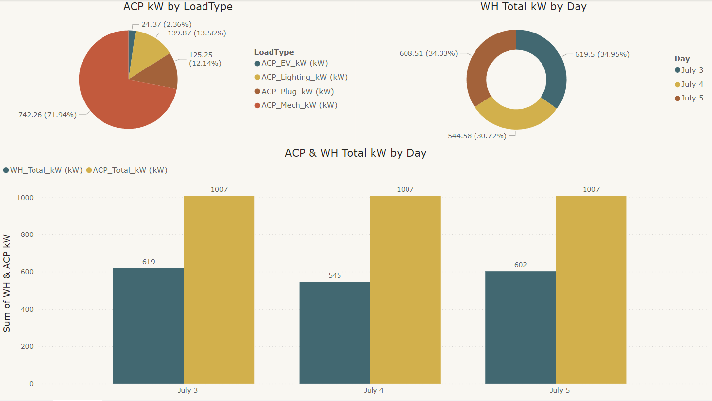

# Sustainability Power BI Dashboard

## Energy Consumption Analysis 📈

**Key Insights:**
- **ACP Dominates Energy Load:** ACP (Air Conditioning Power) usage represents a significant portion of the total load, with **71.94%** on July 3. 🌡️🔋
- **Mechanical Load is Substantial:** Within ACP, mechanical load (ACP_Mech_kW) is the largest consumer, accounting for **13.56%**. 🏭💡
- **Stable WH Consumption:** WH (Water Heating) total kW remains relatively stable across the days, with a slight increase on July 5. 🚿📊
- **Daily Total kW Peaks Midweek:** The combined daily total kW for ACP and WH peaks on July 5 at **1007 kW**. 📆🔝

**Detailed Breakdown:**
- **ACP kW by Load Type (Pie Chart):** 
  - ACP_EV_kW: **24.37 kW (2.36%)**
  - ACP_Lighting_kW: **139.87 kW (13.56%)**
  - ACP_Plug_kW: **125.25 kW (12.14%)**
  - ACP_Mech_kW: **742.26 kW (71.94%)**
- **WH Total kW by Day (Donut Chart):** 
  - July 3: **608.51 kW (34.33%)**
  - July 4: **544.58 kW (30.72%)**
  - July 5: **619.5 kW (34.95%)**
- **ACP & WH Total kW by Day (Bar Chart):**
  - July 3: **WH_Total_kW: 619 kW | ACP_Total_kW: 1007 kW**
  - July 4: **WH_Total_kW: 545 kW | ACP_Total_kW: 1007 kW**
  - July 5: **WH_Total_kW: 602 kW | ACP_Total_kW: 1007 kW**

The data points towards a steady demand in water heating while indicating a need to investigate ACP usage patterns, especially mechanical, for potential optimizations. 🕵️‍♂️💡
