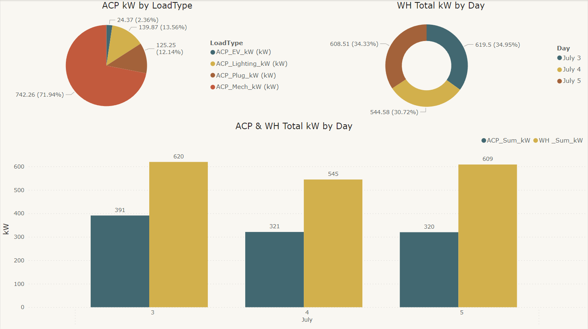

# Sustainability Power BI Dashboard

## Project Goal 🎯

This analysis was conceived as a **30-minute Power BI dashboard challenge**, aiming to showcase the agility and robustness of my Power BI capability in handling ad hoc data request. The exercise tested the tool's capabilities to swiftly generate insights into energy consumption patterns. A focused timeframe pushed the boundaries of rapid data visualization and interpretation under tight constraints. The resulting dashboard not only met the challenge but also provided a springboard for further in-depth analysis.

## Energy Consumption Analysis 📈

**Key Insights:**
- **Mechanical Load Leads ACP:** ACP (Air Conditioning Power) is heavily influenced by mechanical load with **71.94%**. 🏭🔌
- **Consistent ACP Consumption:** ACP consumption was highest on July 3 with **391 kW** and saw a decrease on subsequent days. ⬇️📉
- **WH Usage Varies Slightly:** WH (Water Heating) shows minor variations, peaking at **620 kW** on July 3. 🌊🔥
- **Combined Load Peaks on July 3 & 5:** The total kW for ACP and WH shows two peaks on July 3 and 5, at **1011 kW** and **929 kW** respectively. 📈🔝

**Detailed Breakdown:**
- **ACP kW by Load Type (Pie Chart):** 
  - ACP_EV_kW: **24.37 kW (2.36%)**
  - ACP_Lighting_kW: **139.87 kW (13.56%)**
  - ACP_Plug_kW: **125.25 kW (12.14%)**
  - ACP_Mech_kW: **742.26 kW (71.94%)**
- **WH Total kW by Day (Donut Chart):** 
  - July 3: **619.5 kW (34.95%)**
  - July 4: **544.58 kW (30.72%)**
  - July 5: **608.51 kW (34.33%)**
- **ACP & WH Total kW by Day (Bar Chart):**
  - July 3: **ACP_Sum_kW: 391 kW | WH_Sum_kW: 620 kW**
  - July 4: **ACP_Sum_kW: 321 kW | WH_Sum_kW: 545 kW**
  - July 5: **ACP_Sum_kW: 320 kW | WH_Sum_kW: 609 kW**

The data highlights the significant impact of mechanical systems on ACP load and suggests a detailed review of energy consumption patterns for both ACP and WH.🕵️‍♂️🔍

**Takeaways:**
- **Holiday Impact:** The lower energy consumption on July 4 aligns with it being a federal holiday, likely leading to reduced building occupancy and consequently, lower ACP and WH loads. 🏢📉
- **Weather Influence on ACP Usage:** The variations in ACP usage on July 3 and July 5 suggest that weather conditions may have been a factor. Historical weather data could be analyzed to determine the impact of temperature on energy consumption. ☀️🌡️
